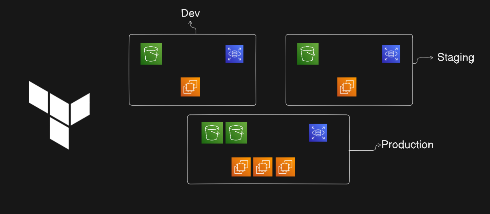

# Multi-Stage Deployment with Terraform


Welcome to the **Multi-Stage Deployment Project**, an infrastructure-as-code (IaC) solution built with Terraform to automate the deployment of AWS resources across multiple environments: **Development (Dev)**, **Staging (Stage)**, and **Production (Prod)**.

## Overview

This project automates the creation and management of AWS resources across three environments:
- **Each environment contains:** 
  - S3 bucket
  - EC2 instance
  - DynamoDB table

By using Terraform, the project ensures consistency, scalability, and maintainability while enabling easy updates and rollbacks.

## Features

- **Multi-Stage Environments:** Isolated environments (Dev, Stage, Prod) to support agile development and testing.
- **AWS Resource Automation:** Fully automated setup of EC2, S3, and DynamoDB resources.
- **Terraform Best Practices:** Modular structure with variables and outputs for reusable configurations.
- **Scalability:** Easily adapt to growing infrastructure needs with minimal changes.
- **Cost Efficiency:** Separate environments for efficient resource usage and testing.

---

## Prerequisites

To use this project, you will need:
1. An AWS account with programmatic access enabled.
2. Terraform CLI installed. [Get it here](https://developer.hashicorp.com/terraform/downloads).
3. Configured AWS CLI with credentials. Run:
   ```bash
   aws configure

## How to Star the Repository
If you find this project helpful, please star the repository on GitHub to show your support:
1. Click the ⭐ button in the top-right corner.

---

## Author
**Jibran**  
Passionate DevOps Engineer and Software Developer.
Connect with me on [LinkedIn](https://www.linkedin.com/in/muhammad-jibran220/).


---
 

## Feedback & Contributions
Contributions are welcome! Feel free to fork the repository and submit a pull request.

---
 